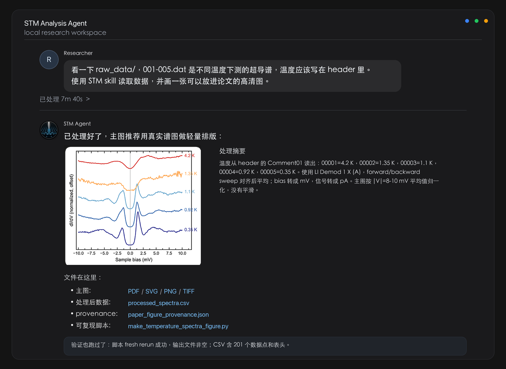
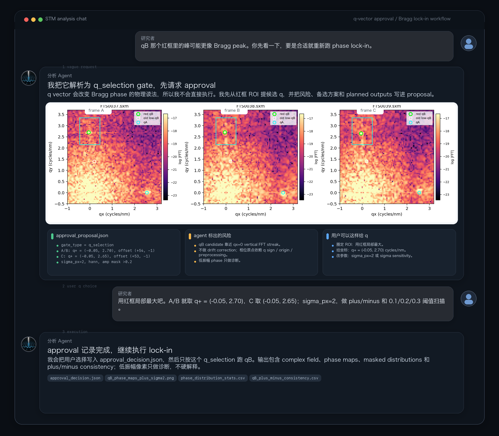
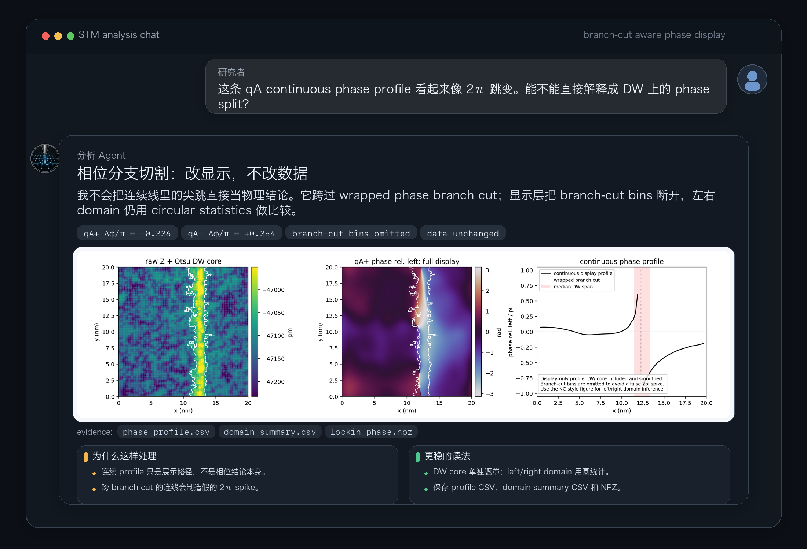

<div align="center">
  

  <h1>STM/SJTM Data Processing Agent Skill</h1>

  <p><strong>From raw Nanonis files to paper-ready STM figures, with data contracts, approval gates, and reproducible evidence built in.</strong></p>

  <p>
    <a href="README.md"></a>
    <a href="README.zh-CN.md"></a>
    
    
    
    
  </p>

  <p>
    <a href="docs/tutorials/agent-guided-stm-data-analysis.md">Tutorial</a>
    · <a href="https://github.com/Wangq1h/Nanonis-STM-Analysis-Skill/wiki">Wiki</a>
    · <a href="references/workflow.md">Workflow</a>
    · <a href="references/data-contracts.md">Data Contracts</a>
    · <a href="references/approval-gates.md">Approval Gates</a>
  </p>
</div>

---



This repository contains a portable agent skill and the public installable AnalySTM 3.0 backend for scanning tunneling microscopy (STM), scanning tunneling spectroscopy (STS), and superconducting-tip STM (SJTM) data processing. It helps agents read raw data, plot spectra, run fitting and lock-in helpers, preserve data contracts, apply approval gates, and produce reproducible evidence packages without requiring a private PySIDAM checkout.

The package is documentation-first, with a headless Python package under `src/analystm`, a CLI named `analystm`, portable helper scripts for runtime probing, safe dependency bootstrapping, installed-skill syncing, and a legacy agent bridge over PySIDAM. It does not contain private experimental data or dataset-specific scripts.

## Why This Skill Exists

STM data analysis is full of small choices that matter: channel names, bias units, sweep direction, gap windows, q vectors, masks, and normalization ranges. This skill gives an agent a disciplined working mode: first establish the data contract, then propose sensitive parameters, then return figures and evidence that another researcher can rerun.

## STS Figure Extraction in Action

> **Researcher:**
> "Look at `raw_data/`. The files `001-005.dat` are superconducting spectra taken at different temperatures. The temperatures should be in the headers. Use the STM skill, read the data, and make a clean figure that can go into a paper."

Seven minutes later, the agent comes back with a compact, auditable result:

- read the temperatures from each file header: `4.2 K`, `1.35 K`, `1.1 K`, `0.92 K`, `0.35 K`;
- selected `LI Demod 1 X (A)`, aligned forward/backward sweeps, converted bias to `mV` and signal to `pA`;
- normalized the main plot by the average signal in `|V| = 8-10 mV`;
- made a vertically offset stacked spectrum figure without smoothing;
- exported paper-facing `PDF`, `SVG`, `PNG`, and `TIFF`;
- saved `processed_spectra.csv`, `paper_figure_provenance.json`, and the rerunnable script;
- reran the script from scratch and verified all outputs were nonempty.

That is the intended feel of this skill: not a black box that says "done", but a careful lab assistant that shows what it read, what it changed, which choices stayed auditable, and where every output lives.

## Approval Gates in Action

The same pattern matters even more for Bragg/QPI work. A vague request such as "the red-box qB peak looks more like a Bragg peak" is not treated as permission to run a phase analysis. The agent first turns it into a `q_selection` gate: propose the ROI-derived q vector, show the FFT evidence, list the risks, and wait for the user to approve or modify the scientific parameters.

<p align="center">
  
</p>

In this example, the user can confirm the choice in several natural ways: accept the red-ROI local maximum, type an explicit q vector, or adjust the lock-in filter. Only after that does the agent write `approval_decision.json` and continue with the qB lock-in outputs.

## Phase Hygiene in Action

Phase maps have their own traps. When a continuous display profile appears to jump by nearly `2π`, the skill pushes the agent to separate display artifacts from physical interpretation: branch-cut bins can be omitted from the plotted profile, while the underlying phase data and left/right domain statistics remain auditable.

<p align="center">
  
</p>

That distinction is deliberate. The agent may improve the figure so it does not imply a false spike, but it should not turn a wrapped-phase branch cut into a physical phase-jump claim.

## What It Helps Agents Do

- **Read raw files safely**: inspect `.3ds`, `.sxm`, `.dat`, `.ibw`, `.csv`, `.tsv`, and text spectra without copying private data into the skill repository.
- **Preserve data contracts**: record shape, axis order, bias units, divider, scan size, coordinate frame, selected channels, flips, transposes, and masks.
- **Use AnalySTM first**: run supported public workflows through the headless `analystm` backend, with PySIDAM kept as a development reference and explicit legacy fallback.
- **Stop for approval when it matters**: require user approval for agent-selected fit windows, q vectors/filter sigma, and multipeak peak counts.
- **Package evidence**: save `report.json`, NPZ arrays, CSV tables, figures, approval records, warnings, and rerunnable commands.
- **Keep interpretation cautious**: separate measured results from physical claims such as YSR states, topological modes, strain correlations, or phase jumps.

## Supported Work

- STM topography processing, background correction, FFT inspection/filtering, Bragg peak selection, low-frequency drift correction, and atom or lattice-site detection.
- STS and grid spectroscopy workflows, including gap extraction, superconducting gap fitting, multipeak fitting, ZBP handling, and batch gap maps.
- SJTM workflows including Josephson-current maps, zero-bias conductance or superfluid proxies, gap-height maps, Z-ratio maps, and SIS/NIS deconvolution guidance.
- Fourier, 1D/2D QPI, FFT ROI filtering, and complex lock-in phase analysis with amplitude-gated statistics.
- Cross-observable comparison across topography, spectroscopy, gap maps, atom sites, strain, and phase fields.
- Standardized user approval gates for agent-selected fit windows, FFT/q-vector and filter-sigma choices, and multipeak peak counts.
- Reproducible reporting with machine-readable outputs and diagnostic figures.

## Quick Start

For a new STM/SJTM analysis thread, start with a prompt like:

```text
Use the stm-sjtm-data-processing skill.

Workspace:
/path/to/stm-workspace

Read:
/path/to/stm-workspace/data_manifest.json
/path/to/stm-workspace/outputs/initial_file_inventory.json

Raw data are referenced through raw_data. Do not copy raw data into the skill repo.

First confirm file shapes, axis order, bias unit/divider, channels, scan size,
pixel size, coordinate frame, and origin convention.

If you need to choose a fit window, q vector/filter sigma, or peak count,
write approval_proposal.json first and wait for my approval before execution.
```

For any STM/SJTM task, an agent should:

1. Run `analystm --help` after installation, or `PYTHONPATH=src python3 -m analystm --help` from a source checkout with dependencies installed, to confirm the public backend is available.
2. For simple STS `.dat` reading or diagnostic plots, use the quick card `references/task-cards/sts-dat-quick.md`, then prefer `analystm read` and `analystm plot-spectrum`.
3. For gap fitting, read `references/task-cards/gap-fit-quick.md`, then use `analystm fit-gap` for single-spectrum superconducting gap fitting.
4. If a command requires optional raw-data dependencies, run `python3 scripts/resolve_runtime.py --probe`; if no cached runtime is ready and local execution is allowed, run `python3 scripts/bootstrap_runtime.py --groups headless` to create an isolated user runtime.
5. Use the legacy `scripts/pysidam_agent/*` bridge only for explicit PySIDAM regression runs or historical compatibility checks; new reportable work should use `analystm`.
6. For deeper tasks, classify the request using `references/workflow.md` and query `references/pysidam-capability-index.json` with `scripts/pysidam_agent/capabilities.py`.
7. Before quantitative fitting, map extraction, phase claims, or scientific conclusions, read `references/runtime-bootstrap.md`, `references/data-contracts.md`, and `references/quality-checks.md`.
8. If the agent chooses a fitting interval, q vector/q window/filter sigma, or multipeak peak count, use `references/approval-gates.md` and stop for user approval before formal execution.
9. Produce outputs that include inputs, data contracts, parameters, approval decisions when gated, quality metrics, warnings, and reproducibility notes.

For local runtime checks:

```bash
python3 scripts/resolve_runtime.py --probe
```

If no cached runtime is ready:

```bash
python3 scripts/bootstrap_runtime.py --groups headless
```

## AnalySTM Backend

AnalySTM is the public headless backend for this skill. It is packaged as `analystm`, exposes Python APIs through `import analystm`, and provides the `analystm` CLI for agent workflows.

For local development:

```bash
python3 -m pip install -e .
python3 -m analystm --help
```

Core CLI entry points:

```bash
analystm read data/example.dat --quick --output-json outputs/read_summary.json
analystm plot-spectrum data/example.dat --output outputs/spectrum.png --summary-json outputs/spectrum.json
analystm fit-gap data/example.dat --model "Two Band s-wave" --output-dir outputs/gap_fit
analystm bragg policy --output-json outputs/q_policy.json
analystm phase-lockin data/topo.npy --scan-size-nm 20 20 --q q1=1.5,0.0 --output-dir outputs/phase_lockin
analystm gap-map data/cube.npz --left-window -2.5 -0.5 --right-window 0.5 2.5 --output-dir outputs/gap_map
analystm multipeak fit data/linecut.npz --n-peaks 4 --fit-range -2.0 2.0 --background-mode full_trace_linear --output-dir outputs/multipeak
analystm intensity process data/linecut.npz --mode neg_d3 --bias-range -2 2 --output-dir outputs/intensity
analystm intensity z-ratio data/cube.npz --energy-mv 1.0 --output-dir outputs/z_ratio
analystm intensity peak-align-zero data/cube.npz --neg-window -1.4 -0.6 --pos-window 0.6 1.4 --output-dir outputs/peak_align_zero
analystm waterfall fit data/linecut_cube.npz --linecut 0 64 127 64 --neg-range -1.2 -0.4 --pos-range 0.4 1.2 --output-dir outputs/waterfall
analystm waterfall peak-align-zero data/linecut_cube.npz --neg-range -1.4 -0.6 --pos-range 0.6 1.4 --output-dir outputs/waterfall_align
analystm qpi symmetry data/qpi_stack.npz --order 4 --output-dir outputs/qpi_symmetry
analystm qpi pr-qpi data/qpi_cube.npz --slider-min 40 --slider-max 80 --output-dir outputs/pr_qpi
analystm qpi fft-volume data/qpi_cube.npz --window Hanning --scale-mode "Signed Sqrt" --output-dir outputs/qpi_fft
analystm qpi 1d-fft data/qpi_cube.npz --scan-size-nm 20 20 --p1 2 10 --p2 18 10 --cube-order xyb --output-dir outputs/qpi_1d_fft
analystm qpi fft-filter data/qpi_cube.npz --scan-size-nm 20 20 --circle 1.5 0.0 0.2 --output-dir outputs/qpi_fft_filter
analystm qpi real-phase data/real_phase_pair.npz --ref-key ref --target-key target --q1 12 18 --q2 18 12 --sigma-px 4 --output-dir outputs/qpi_real_phase
analystm spectroscopy process data/spec.npz --x-key bias --y-key didv --auto-offset --norm-mode Max --output-dir outputs/spectroscopy
analystm spstm didv data/spstm_spectra.npz --x-key bias --a-key didv_a --b-key didv_b --norm-mode-a Max --norm-mode-b Max --output-dir outputs/spstm_didv
analystm spstm qpi-r90 data/spstm_qpi.npz --map-key qpi --output-dir outputs/spstm_qpi_r90
analystm topography lf-drift data/topo.npz --q1 1.0 0.0 --q2 0.0 1.0 --output-dir outputs/topography_lf
analystm topography display-fft data/topo.npz --scan-size-nm 20 --window Hanning --scale-mode Log --output-dir outputs/topography_display_fft
analystm topography fft-filter data/topo.npz --scan-size-nm 20 20 --circle 1.5 0.0 0.2 --output-dir outputs/topography_fft_filter
analystm histogram data/map.npz --data-key topo --background-mode "Sub Plane (Global)" --output-dir outputs/histogram
analystm crop map data/grid.npz --data-key cube --kind 3ds --center-px 128 128 --side-px 96 --scan-size-nm 20 20 --output-dir outputs/crop
analystm path-viz build path_batches.json --output-dir outputs/path_viz
analystm publication payload data/figure_payload.npz --image-key image --x-key x --y-key y --output-dir outputs/publication
analystm export spec-dat data/spectrum.npz --column "Bias calc (V)=bias" --column "LI Demod 1 X (A)=didv" --output outputs/spectrum.dat
analystm export grid-3ds data/grid.npz --channel "LI Demod 1 X (A)=cube" --bias-key bias --scan-size-nm 20 --output outputs/grid.3ds
analystm sjtm data/sjtm_cube.npz --neg-window -1.1 -0.35 --pos-window 0.35 1.1 --rn-window 1.2 2.2 --g0-window -0.2 0.2 --ic-fit-mode accurate --output-dir outputs/sjtm
analystm deconvolve data/sis_point.npz --mode sis --temperature-k 0.4 --tip-delta-mev 1.2 --tip-gamma-mev 0.03 --output-dir outputs/deconvolution
analystm atom recommend-scale --shape-yx 512 512 --scan-size-nm 20 20 --resize-ratio 1.5 --expected-spacing-nm 0.3515625
analystm atom lattice-qc outputs/atoms.csv --expected-spacing-nm 0.3515625 --scan-size-nm 20 20
analystm atom wipe-regions outputs/atoms.csv --regions-json regions.json --output-csv outputs/atoms_wiped.csv
analystm domain-wall build-masks --shape-yx 128 128 --scan-size-nm 30 30 --regions-json dw_regions.json --near-width-nm 1.0 --output-dir outputs/domain_wall
analystm domain-wall stats outputs/ingap_map.npy --masks-npz outputs/domain_wall/data/domain_wall_masks.npz --metric-name strict_ingap --output-dir outputs/domain_wall_ingap_stats
```

The current public backend includes portable IO contracts, imported text/NPZ/IBW readers, Nanonis `.dat`/`.3ds` and optional IBW export helpers, publication payload helpers, copied Nanonis reader utilities that depend on optional `nanonispy`, spectroscopy display processing, superconducting gap model evaluation and fitting helpers, Bragg/q policy helpers, 2D complex lock-in extraction, PySIDAM-derived gap-map peak fitting, UniversalVortexFitterEngine multipeak fitting, waterfall linecut-map peak extraction and peak-align-zero calibration, topography display/FFT processing, topography LF drift correction and FFT ROI filtering, useful-tools histogram/map-crop/path-viz algorithms, linecut intensity processing, Z-ratio maps, peak-align-zero bias calibration, QPI display FFT volumes, 1D-QPI K-E FFT, QPI FFT ROI filtering, PR-QPI/PQPI, QPI symmetry and real-phase p_LL helpers, SPSTM dI/dV/map/QPI contrast helpers, SJTM Quick/Accurate Ic and superfluid calculations, SIS deconvolution, grid deconvolution matrix/stat helpers, approval gates, atom QC/wipe helpers, and Domain Wall mask/stat tooling.

AI atom-recognition scale guidance, post-detection lattice QC, and human-marked wipe/report tooling are public in AnalySTM 3.0. The detector model and weights remain optional external dependencies for now; open-sourcing the AI model is the next planned release step.

Replacement coverage is tracked in `docs/analystm_replacement_coverage.md`.

## Runtime Bootstrap

The skill ships dependency manifests under `runtime/` and a safe bootstrapper:

```bash
python3 scripts/bootstrap_runtime.py --groups headless
```

The core manifest is `runtime/requirements-core.txt`; companion manifests cover Nanonis IO, IBW export, and the planned optional AI atom-detector integration. The default runtime does not require PySIDAM, PyQt5, or pyqtgraph.

`headless` expands to:

```text
core + nanonis + ibw
```

This installs core numerical tools, `nanonispy`, and `igorwriter` into a per-skill virtual environment under a user-writable cache directory. It never uses `sudo`, never installs into system Python, never modifies conda base, and never runs `brew`.

The AI group is available only when explicitly testing the future detector integration:

```bash
python3 scripts/bootstrap_runtime.py --groups headless,ai
```

For offline or controlled installs, provide a wheelhouse:

```bash
python3 scripts/bootstrap_runtime.py --groups headless --no-network --wheelhouse /path/to/wheelhouse
```

Useful safety flags:

```bash
python3 scripts/bootstrap_runtime.py --dry-run
python3 scripts/bootstrap_runtime.py --groups headless --pysidam-mode none
python3 scripts/bootstrap_runtime.py --groups headless --pysidam-mode auto --pysidam-root /path/to/pysidam
```

The bootstrapper writes `runtime.json` inside the cache with the venv path, dependency groups, AI integration status, optional legacy PySIDAM source path, and post-install probe results.

For repeated use across project directories, use the resolver:

```bash
python3 scripts/resolve_runtime.py
python3 scripts/resolve_runtime.py --probe
python3 scripts/resolve_runtime.py --print-python
python3 scripts/resolve_runtime.py --bootstrap-command
```

The resolver calls `scripts/probe_runtime.py` through the cached runtime Python when a prepared runtime exists. By default that probe checks AnalySTM/headless dependencies only and reports AI atom detection as `planned`.

Host-specific defaults belong in:

```text
~/.config/stm-sjtm-data-processing/host.json
```

The skill repository should stay portable; do not commit host paths. A local PySIDAM checkout is ignored unless `include_legacy_pysidam` is explicitly enabled for regression work.

## PySIDAM Agent Bridge

The bridge scripts under `scripts/pysidam_agent/` are legacy compatibility adapters for explicit PySIDAM regression runs and historical workflows. They are outside the default runtime. When legacy mode is explicitly enabled, they can auto-reexec into the cached runtime from `runtime.json`, add the configured PySIDAM source root, and emit compact JSON or PNG outputs.

```bash
python3 scripts/pysidam_agent/capabilities.py --domain core_io
python3 scripts/pysidam_agent/read_file.py --quick data/example.dat --output-json outputs/read_summary.json
python3 scripts/pysidam_agent/plot_spectrum.py data/example.dat --output outputs/spectrum.png --summary-json outputs/spectrum.json
python3 scripts/pysidam_agent/fit_gap.py data/example.dat --model "Two Band s-wave" --output-dir outputs/gap_fit
python3 scripts/pysidam_agent/bragg_phase.py policy
python3 scripts/pysidam_agent/bragg_phase.py inspect-roi data/topo.sxm --roi -0.5 0.5 2.0 3.0 --output-json outputs/q_roi.json
python3 scripts/pysidam_agent/phase_lockin.py run data/topo.npy --scan-size-nm 20 20 --q q1=1.5,0.0 --output-dir outputs/phase_lockin
python3 scripts/pysidam_agent/bragg_phase.py lockin-from-decision --decision approvals/approval_decision.json --raw-root raw_data --output-dir outputs/bragg_phase
python3 scripts/pysidam_agent/atom_ai.py recommend-scale --shape-yx 512 512 --scan-size-nm 20 20 --resize-ratio 1.5 --expected-spacing-nm 0.3515625
python3 scripts/pysidam_agent/atom_ai.py lattice-qc outputs/atoms.csv --expected-spacing-nm 0.3515625 --scan-size-nm 20 20
python3 scripts/pysidam_agent/atom_ai.py wipe-regions outputs/atoms.csv --regions-json regions.json --output-csv outputs/atoms_wiped.csv
python3 scripts/pysidam_agent/domain_wall.py build-masks --shape-yx 128 128 --scan-size-nm 30 30 --regions-json dw_regions.json --near-width-nm 1.0 --output-dir outputs/domain_wall
python3 scripts/pysidam_agent/domain_wall.py stats outputs/ingap_map.npy --masks-npz outputs/domain_wall/data/domain_wall_masks.npz --metric-name strict_ingap --output-dir outputs/domain_wall_ingap_stats
```

The bridge is intentionally outside PySIDAM. It does not modify PySIDAM source, avoids Qt windows by default, and keeps full headers and raw arrays out of JSON summaries unless explicitly requested. For `.3ds` files, `read_file.py` defaults to divider `1.0` because Nanonis bias axes are treated as already divider-corrected by the experiment software; apply extra scaling only when the user explicitly requests it. For new work, prefer the equivalent `analystm` commands first. For legacy gap fitting, the bridge delegates to the bundled headless `pysidam_agent_core.gap_fitting.fit_gap_model_guarded`. For Bragg phase work, the public `analystm phase-lockin` command records `analystm.phase_lockin.lockin_phase_extraction` as the lock-in engine, while the legacy bridge may still record the PySIDAM engine string when it is explicitly used. Downstream strain, phase-jump, or spectroscopy-correlation scripts should consume the saved package instead of reimplementing lock-in. For AI atom recognition, `atom_ai.py` records detector scale choices such as `resize_ratio`, checks the resulting square-lattice site quality, and applies human-requested DW or defect-region wipes without relabeling atoms outside those regions. For Domain Wall comparisons, `domain_wall.py` keeps human-marked broad DW geometry, refined on-DW masks, near-DW masks, and away masks in one reusable package so spectroscopy, topography, and phase maps use the same region definition.

## Approval Gates

Version `v0.2.3` adds a standard approval workflow for scientifically sensitive agent choices:

- `fit_window`: fitting intervals, superconducting coherence-peak windows, and peak-search windows.
- `q_selection`: FFT-derived q vectors, q windows, and filter sigma for QPI, lock-in, p_LL, or phase analysis.
- `peak_count`: number of peaks in multipeak fitting.

Agents create `approval_proposal.json`, optionally render a static review page with `scripts/approval_gate.py render-html`, wait for approval or modification, then continue only from `approval_decision.json`. Routine IO, previews, crop QC, summaries, and exports remain provenance-only and do not require separate approval.

Useful commands:

```bash
python3 scripts/approval_gate.py validate-proposal --proposal approval_proposal.json
python3 scripts/approval_gate.py render-html --proposal approval_proposal.json --output approval_review.html
python3 scripts/approval_gate.py validate-decision --decision approval_decision.json
python3 scripts/approval_gate.py validate-report --report report.json --decision-path approval_decision.json
```

## Skill Installation

Copy or synchronize this repository root to:

```text
~/.codex/skills/stm-sjtm-data-processing/
```

The Codex entry point is `SKILL.md`. The portable references remain under `references/`.

For local development, prefer:

```bash
python3 scripts/sync_installed_skill.py
```

This updates `~/.codex/skills/stm-sjtm-data-processing/` and removes installed `.git` metadata, so installed skills behave like plain packages while this source repository remains the Git working copy.

## Other Agent Runtimes

Agents that do not support Codex skills can read this repository directly:

1. Start with this `README.md`.
2. Load `references/workflow.md` and `references/data-contracts.md`.
3. Load the domain reference needed for the user request.
4. Treat `SKILL.md` as optional adapter text.

## References

- [Agent-guided STM Data Analysis](docs/tutorials/agent-guided-stm-data-analysis.md)
- [GitHub Wiki](https://github.com/Wangq1h/Nanonis-STM-Analysis-Skill/wiki)
- [Workflow reference](references/workflow.md)
- [Data contracts](references/data-contracts.md)
- [Quality checks](references/quality-checks.md)
- [Approval gates](references/approval-gates.md)
- [PySIDAM capability map](references/pysidam-capability-map.md)
- [AnalySTM replacement coverage](docs/analystm_replacement_coverage.md)

## Developer Reference

- Runtime manifest: `runtime/requirements-core.txt`
- Runtime probe script: `scripts/probe_runtime.py`
- Quick task cards: `references/task-cards/sts-dat-quick.md`, `references/task-cards/gap-fit-quick.md`
- Capability index: `references/pysidam-capability-index.json`
- Other Agent Runtimes: read this README first, then load the workflow, data-contract, and domain references needed for the task.
- GitHub Release: release notes live in `docs/releases/`; the current release line follows the latest versioned release note.

## pysidam Relationship

`pysidam` is now treated as a development reference and legacy fallback, not as a public runtime requirement for supported AnalySTM commands. Agents may still use `references/pysidam-capability-index.json`, `references/pysidam-capability-map.md`, and `references/pysidam-tool-map.md` to audit PySIDAM source mappings or run explicit legacy comparisons. The repository keeps `pysidam_agent_core/` and `scripts/pysidam_agent/` for compatibility, while public reportable work should use `src/analystm`.

AnalySTM is the replacement backend surface: reports should name `analystm.*` functions as the execution engine and keep PySIDAM function names only under source-mapping fields such as `pysidam_source_mapping`. If AnalySTM intentionally improves or changes a PySIDAM-derived algorithm, the change belongs in code, tests, and release notes instead of being hidden behind a compatibility claim.

Raw Nanonis `.3ds`, `.sxm`, and `.dat` in AnalySTM use optional `nanonispy` reader utilities; missing `nanonispy` should be reported as a dependency gap, not worked around with an unverified binary parser. PXP is not claimed as supported by the current public backend.

PySIDAM is not assumed to be a standard pip package. The bootstrapper ignores PySIDAM by default; it uses an explicit `--pysidam-mode auto --pysidam-root ...` only for legacy bridge commands. It does not mutate existing user checkouts.

The default runtime dependency set is documented in `references/runtime-bootstrap.md`. The probe distinguishes default AnalySTM/headless capability from explicit legacy and planned AI checks.

## Validation

Run:

```bash
python3 scripts/validate_package.py
```

Expected:

```text
PASS: stm-sjtm-data-processing package is structurally valid
```

## GitHub Release

The current release line is `v3.0.1`. Release notes live in `docs/releases/RELEASE_NOTES_v3.0.1.md`.
